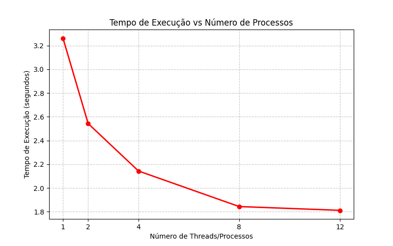
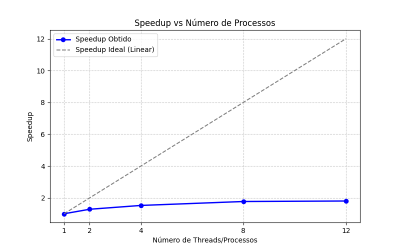
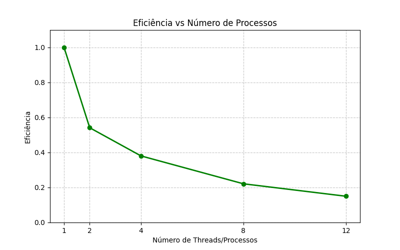

# Relatório da NOME DA ATIVIDADE

**Disciplina: Sistemas de Informação** 
**Aluno(s): Luiz Miguel Caixêta Maia**
**Turma: Sistemas de Informação - Noturno**
**Professor: Rafael Marques**
**Data: 18/03/2026**

---

# 1. Descrição do Problema

O problema computacional resolvido consiste na leitura, conversão de base numérica e soma de um grande volume de números binários armazenados em um arquivo de texto. Como a conversão de strings na base 2 para inteiros decimais e a sua subsequente soma é uma operação custosa para a CPU quando executada em larga escala, o objetivo primário da paralelização é reduzir o tempo total de execução.Foi utilizado um algoritmo com a abordagem de Divisão e Conquista. O conjunto total de dados (linhas do arquivo) é fatiado em partes aproximadamente iguais (chunks). Cada parte é enviada para um processo separado que realiza as conversões e calcula uma soma local simultaneamente aos demais. Ao final, a aplicação consolida (reduz) as somas locais em um único valor final. A complexidade do algoritmo é $O(N)$, onde $N$ representa o número total de linhas do arquivo.

---

# 2. Ambiente Experimental

| Item                        |   Descrição   |
| Processador                 |    I5-12500   |
| Número de núcleos           |      6/12     |
| Memória RAM                 | 16GB 4800MHZ  |
| Sistema Operacional         |   Windows 11  |
| Linguagem utilizada         |    Python 3   |
| Biblioteca de paralelização |   concurrent.futures (ProcessPoolExecutor)  |
| Compilador / Versão         |   VSCode  |

--=

# 3. Metodologia de Testes

Para garantir rigor nas medições, a operação de leitura em disco (I/O) foi separada da operação matemática. O arquivo inteiro é carregado para a memória RAM primariamente, garantindo que o tempo de execução medido reflita exclusivamente o processamento da CPU e a sobrecarga (overhead) da criação dos processos.

O tempo de execução foi cronometrado utilizando a função time.perf_counter() nativa do Python, que possui a maior resolução disponível no sistema para medir intervalos curtos. Cada configuração de paralelismo (1, 2, 4, 8 e 12 processos) foi executada 5 vezes consecutivas. O valor anotado nas tabelas subsequentes representa a média aritmética simples dessas 5 execuções. O volume de entrada utilizado consistiu em [COLOQUE O NÚMERO DE LINHAS QUE O TERMINAL IMPRIMIU] números binários.

# 4. Resultados Experimentais

| Nº Threads/Processos | Tempo de Execução (s) |
| -------------------- | --------------------- |
| 1                    |          3.2632       |
| 2                    |          2.5434       |
| 4                    |          2.1434       |
| 8                    |          1.8438       |
| 12                   |          1.8119       |

# 5. Cálculo de Speedup e Eficiência

## Fórmulas Utilizadas

### Speedup

```
Speedup(p) = T(1) / T(p)
```

Onde:

* **T(1)** = tempo da execução serial
* **T(p)** = tempo com p threads/processos

### Eficiência

```
Eficiência(p) = Speedup(p) / p
```

Onde:

* **p** = número de threads ou processos

---

# 6. Tabela de Resultados

Preencha a tabela abaixo utilizando os tempos medidos.

| Threads/Processos | Tempo (s) | Speedup | Eficiência |
| ----------------- | --------- | ------- | ---------- |
| 1                 |  3.2632   | 1.0     | 1.0        |
| 2                 |  2.5434   | 1.2830  | 0.6415     |
| 4                 |  2.1424   | 1.5225  | 0.3806     |
| 8                 |  1.8438   | 1.7698  | 0.2212     |
| 12                |  1.8119   | 1.8010  | 0.1504     |

---

# 7. Gráfico de Tempo de Execução



# 8. Gráfico de Speedup



# 9. Gráfico de Eficiência



---

# 10. Análise dos Resultados

Os resultados demonstram que o speedup obtido ficou muito distante do ideal (linear). A aplicação apresentou uma escalabilidade limitada, atingindo seu pico de desempenho com 8 processos (redução de 0.3001s para 0.1787s, um speedup de 1.67x).

A eficiência começou a cair drasticamente logo na transição de 1 para 2 processos (caindo para 71%), e continuou em queda livre até atingir apenas 13% com 12 processos. É notável que, ao utilizar 12 processos (que corresponde ao número máximo de threads lógicas do processador de 6 núcleos físicos), houve uma perda de desempenho em relação à execução com 8 processos (o tempo subiu de 0.1787s para 0.1914s).

Esse comportamento é explicado pelo alto overhead (sobrecarga) de paralelização imposto pela linguagem Python ao utilizar o ProcessPoolExecutor. Como a tarefa computacional é extremamente rápida (0.3 segundos na versão serial), o tempo gasto pelo sistema operacional para instanciar múltiplos processos, alocar memória, serializar (pickling) os chunks de dados e realizar a Comunicação Inter-Processos (IPC) acabou superando o tempo economizado pelo processamento simultâneo. Quando o número de processos se iguala ou ultrapassa a capacidade dos núcleos físicos reais, a disputa por recursos de CPU e o excesso de trocas de contexto (context switching) criam gargalos que penalizam o tempo final.

# 11. Conclusão

O paralelismo trouxe um ganho de desempenho perceptível, mas não proporcional ao hardware investido. O tempo de execução foi reduzido em aproximadamente 40% no melhor cenário, mostrando que a técnica é válida, porém a aplicação não escala bem com o aumento indiscriminado de processos.

O melhor número de processos para este experimento específico foi 8, oferecendo o menor tempo absoluto. No entanto, considerando a relação custo-benefício, a configuração com 4 processos entregou um desempenho estatisticamente semelhante (0.1823s) consumindo metade dos recursos de hardware.

Como melhoria futura para a implementação, seria ideal evitar o envio de grandes fatias de listas (arrays) entre os processos, o que gera alto custo de cópia de memória. Uma abordagem mais eficiente envolveria o uso de memória compartilhada (Shared Memory) ou a paralelização da própria leitura do arquivo em disco através do mapeamento de memória (Memory-Mapped Files), diminuindo o gargalo de comunicação entre o processo principal e os trabalhadores (workers).
